# Домашнее задание к занятию «Организация сети» - `Белов Михаил`

### Подготовка к выполнению задания

1. Домашнее задание состоит из обязательной части, которую нужно выполнить на провайдере Yandex Cloud, и дополнительной части в AWS (выполняется по желанию). 
2. Все домашние задания в блоке 15 связаны друг с другом и в конце представляют пример законченной инфраструктуры.  
3. Все задания нужно выполнить с помощью Terraform. Результатом выполненного домашнего задания будет код в репозитории. 
4. Перед началом работы настройте доступ к облачным ресурсам из Terraform, используя материалы прошлых лекций и домашнее задание по теме «Облачные провайдеры и синтаксис Terraform». Заранее выберите регион (в случае AWS) и зону.

---
### Задание 1. Yandex Cloud 

**Что нужно сделать**

1. Создать пустую VPC. Выбрать зону.

`Не совсем корректная постановка задачи с выбором зоны. Пустая VPC, насколько я понимаю, захватывает все зоны. Выбор зоны начинается при создании подсети`
```
terraform init
terraform plan
terraform apply
```
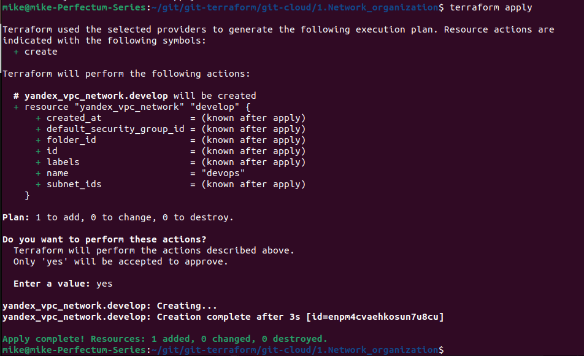
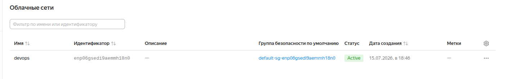
2. Публичная подсеть.

 - Создать в VPC subnet с названием public, сетью 192.168.10.0/24.

 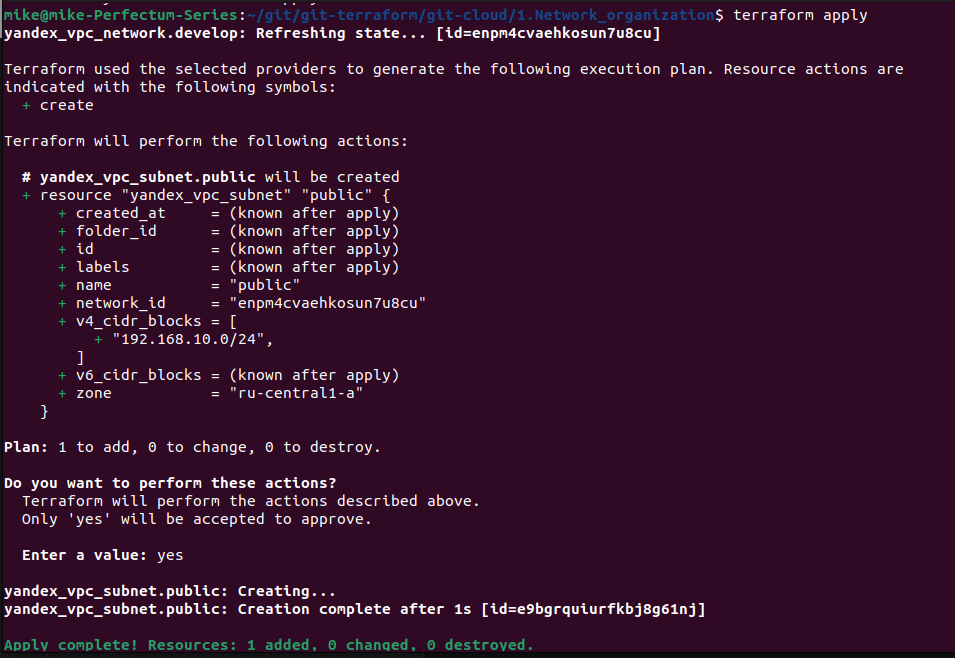
 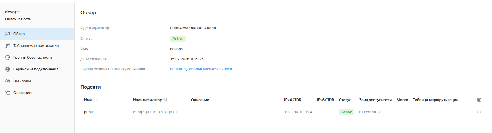
 - Создать в этой подсети NAT-инстанс, присвоив ему адрес 192.168.10.254. В качестве image_id использовать fd80mrhj8fl2oe87o4e1.

 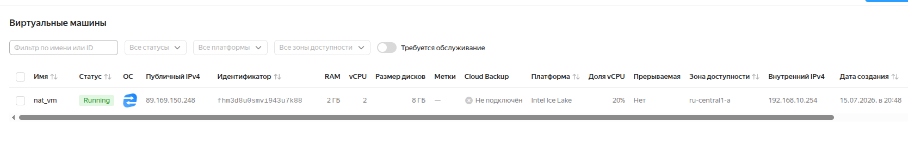

 - Создать в этой публичной подсети виртуалку с публичным IP, подключиться к ней и убедиться, что есть доступ к интернету.

 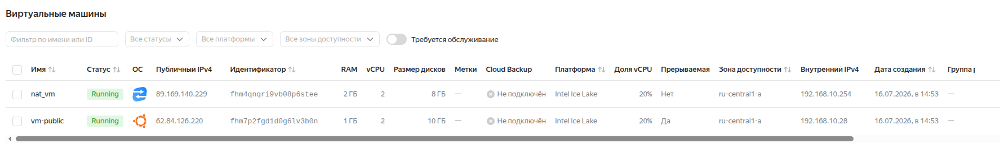
 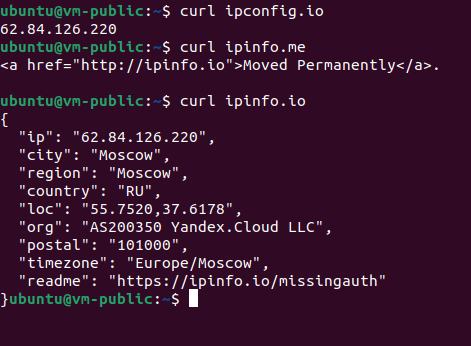

3. Приватная подсеть.
 - Создать в VPC subnet с названием private, сетью 192.168.20.0/24.

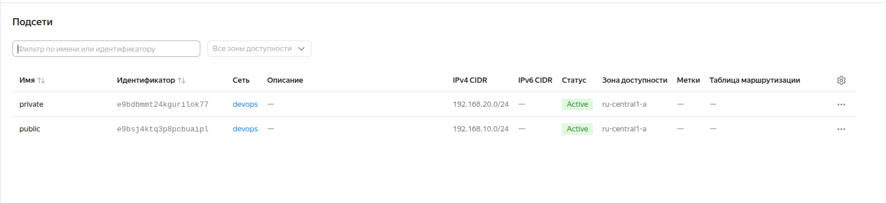

 - Создать route table. Добавить статический маршрут, направляющий весь исходящий трафик private сети в NAT-инстанс.

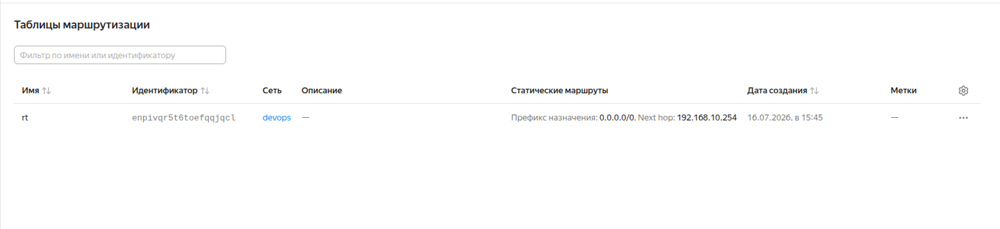
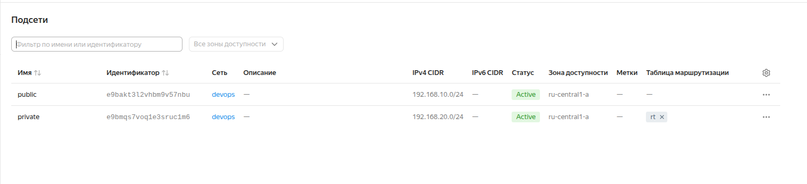

 - Создать в этой приватной подсети виртуалку с внутренним IP, подключиться к ней через виртуалку, созданную ранее, и убедиться, что есть доступ к интернету.
 
 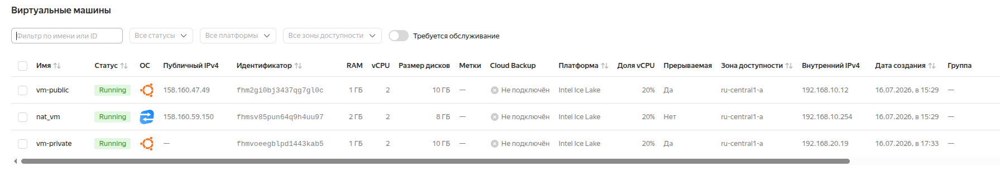
 ```
 ssh -J ubuntu@158.160.47.49 ubuntu@192.168.20.19
 ```
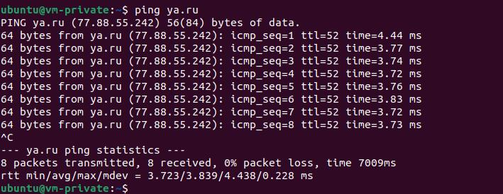

Resource Terraform для Yandex Cloud:

- [VPC subnet](https://registry.terraform.io/providers/yandex-cloud/yandex/latest/docs/resources/vpc_subnet).
- [Route table](https://registry.terraform.io/providers/yandex-cloud/yandex/latest/docs/resources/vpc_route_table).
- [Compute Instance](https://registry.terraform.io/providers/yandex-cloud/yandex/latest/docs/resources/compute_instance).

---
### Задание 2. AWS* (задание со звёздочкой)

Это необязательное задание. Его выполнение не влияет на получение зачёта по домашней работе.

**Что нужно сделать**

1. Создать пустую VPC с подсетью 10.10.0.0/16.
2. Публичная подсеть.

 - Создать в VPC subnet с названием public, сетью 10.10.1.0/24.
 - Разрешить в этой subnet присвоение public IP по-умолчанию.
 - Создать Internet gateway.
 - Добавить в таблицу маршрутизации маршрут, направляющий весь исходящий трафик в Internet gateway.
 - Создать security group с разрешающими правилами на SSH и ICMP. Привязать эту security group на все, создаваемые в этом ДЗ, виртуалки.
 - Создать в этой подсети виртуалку и убедиться, что инстанс имеет публичный IP. Подключиться к ней, убедиться, что есть доступ к интернету.
 - Добавить NAT gateway в public subnet.
3. Приватная подсеть.
 - Создать в VPC subnet с названием private, сетью 10.10.2.0/24.
 - Создать отдельную таблицу маршрутизации и привязать её к private подсети.
 - Добавить Route, направляющий весь исходящий трафик private сети в NAT.
 - Создать виртуалку в приватной сети.
 - Подключиться к ней по SSH по приватному IP через виртуалку, созданную ранее в публичной подсети, и убедиться, что с виртуалки есть выход в интернет.

Resource Terraform:

1. [VPC](https://registry.terraform.io/providers/hashicorp/aws/latest/docs/resources/vpc).
1. [Subnet](https://registry.terraform.io/providers/hashicorp/aws/latest/docs/resources/subnet).
1. [Internet Gateway](https://registry.terraform.io/providers/hashicorp/aws/latest/docs/resources/internet_gateway).

### Правила приёма работы

Домашняя работа оформляется в своём Git репозитории в файле README.md. Выполненное домашнее задание пришлите ссылкой на .md-файл в вашем репозитории.
Файл README.md должен содержать скриншоты вывода необходимых команд, а также скриншоты результатов.
Репозиторий должен содержать тексты манифестов или ссылки на них в файле README.md.